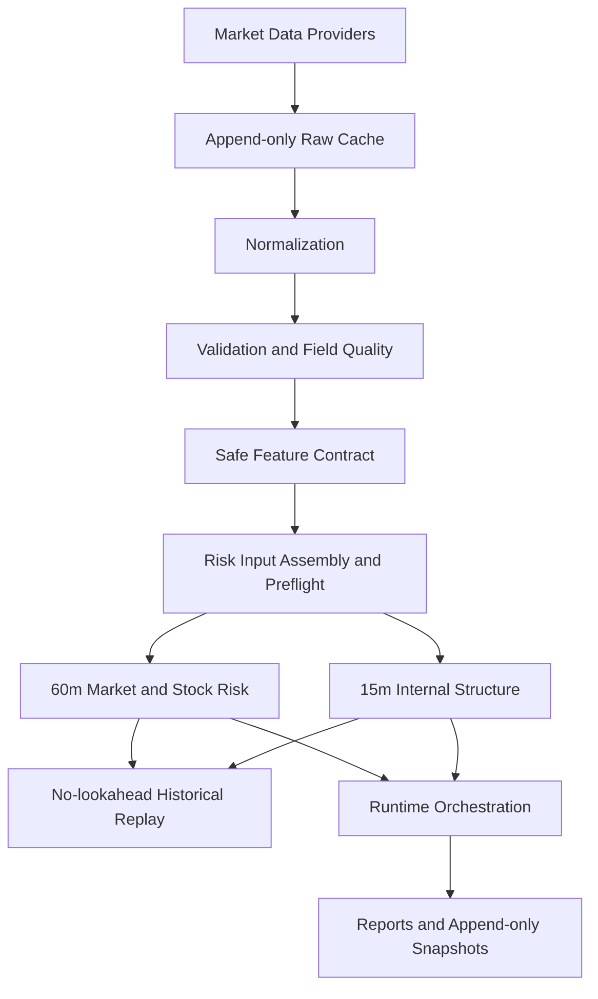

# TrendMonitor

Deterministic intraday market-risk monitoring with data provenance, quality gates, and no-lookahead replay.

[](LICENSE)
[](pyproject.toml)

TrendMonitor is an open-source framework for deterministic intraday market-risk monitoring. It separates market-data ingestion, normalization, quality validation, risk-input assembly, risk engines, historical replay, and unattended runtime orchestration into auditable layers.

It is designed for transparent monitoring and early-warning workflows—not opaque trading signals. The current reference implementation includes an eight-index 60-minute market-risk engine, 15-minute internal-structure analysis, and configurable stock-level intraday risk context.

> **TrendMonitor is not an automated trading system.** It does not place orders, provide guaranteed investment signals, or replace formal investment decisions. The 60-minute layer is a monitoring and early-warning layer; trading decisions remain outside this framework.

The project is early-stage and actively developed. Its core market and stock monitoring pipeline and local unattended runtime are implemented; broader live acceptance, notification adapters, and additional provider coverage remain ongoing work.

## Why TrendMonitor?

Many market-data scripts effectively follow this path:

```text
API → Indicator → Signal
```

TrendMonitor makes the evidence and eligibility decisions explicit:

```text
API → Raw Evidence → Quality → Eligibility → Deterministic Risk → Replay
```

This matters because a valid number is not automatically a valid risk input. Provider timestamps, OHLC semantics, closing buckets, volume definitions, field quality, and historical availability can differ across instruments and periods.

## Architecture



Notification adapters are planned but are not part of the current runtime.

## Design Principles

### Deterministic Core

Risk scores, features, classifications, and flags are computed deterministically in Python. LLMs do not participate in production risk calculations.

### Data Provenance

Eligible features remain traceable through the full data path:

```text
Feature → System Bar → Normalized Record → Raw Provider Data
```

Source identifiers, timestamps, transformations, and lineage are retained for audit and replay.

### Fail Explicitly

TrendMonitor does not silently guess missing mappings, fields, or periods. Unreliable inputs are marked `DEGRADED`, `DISABLED`, or `DATA_INCOMPLETE`, with the reason preserved.

### No-Lookahead Replay

Historical replay is strictly as-of: each result may use only information available at that period boundary. Historical reference distributions and previous results are similarly time-bounded.

### Frozen Rule Versions

Risk rules are versioned. Stored results record the rules version that produced them, preventing silent rule changes from rewriting historical meaning.

## Features

- Provider-agnostic market-data interfaces
- Hithink and Longbridge provider integrations
- Append-only raw cache and source trace
- Explicit provider fallback and failure retention
- Normalized 15-minute and 60-minute System Bars
- Closing-bucket handling with retained lineage
- Field-level data-quality and safe-feature contracts
- Risk Input assembly and Preflight gates
- Deterministic eight-index 60-minute market-risk engine
- 15-minute internal-structure analysis for completed 60-minute periods
- Configurable individual-stock intraday risk context
- Strict as-of historical replay
- Append-only risk and runtime snapshots
- Idempotent macOS `launchd` runtime with lock recovery and catch-up
- Runtime health and secret-permission checks

Industry intraday context is experimental and currently data-limited. Notification adapters are planned. Neither is required by the core market and stock monitoring pipeline.

## Data Quality Matters

Different providers and periods may disagree on OHLC semantics, omit closing buckets, report inconsistent index volume, or expose boundary-specific quirks. TrendMonitor therefore evaluates data per field instead of treating an entire bar as uniformly trustworthy.

Each candidate feature is checked against field quality and eligibility. Close-derived features can remain usable while unverified High/Low triggers, index volume, or advisory turnover fields are disabled. See the [Risk Input Contract](docs/RISK_INPUT_CONTRACT.md) and [Minute Field Quality Profile](docs/MINUTE_FIELD_QUALITY_PROFILE.md).

## Current Risk Model

The reference implementation currently provides:

- A deterministic eight-index 60-minute market-risk engine for monitoring and early warning
- A close-only 15-minute internal-structure layer that explains completed or in-progress 60-minute periods without changing their score
- Stock-level 60-minute risk context and 15-minute internal structure combined with the market environment

The architecture is configurable. The instruments used by the current validation universe are reference configuration, not a fixed product boundary.

Detailed rules and limitations:

- [Market 60m Risk Engine](docs/MARKET_60M_RISK_ENGINE.md)
- [Market 15m Internal Structure](docs/MARKET_15M_INTERNAL_STRUCTURE.md)
- [Stock Intraday Risk Engine](docs/STOCK_INTRADAY_RISK_ENGINE.md)

## Data Providers

| Provider | Current usage | Notes |
| --- | --- | --- |
| Longbridge | Quote, Daily, and 1m/15m/60m market data | Primary minute-data provider in the reference configuration |
| Hithink | Quote, Daily, index/sector metadata, and provider validation | Sector 15m/60m bars are currently unsupported in the verified interface |
| Tushare | Feasibility research only | Not integrated into or required by the core runtime |

Provider support does not include credentials, subscriptions, or redistribution rights.

### Data Licensing

This repository does not redistribute proprietary market data. Raw provider responses, normalized local data, risk snapshots, replay outputs, and runtime evidence are intentionally excluded from Git.

Users must obtain and configure their own provider credentials. Compliance with provider terms, permissions, licensing, and applicable market-data rules remains the user's responsibility.

## Quick Start

Requirements:

- Python 3.11 or newer
- [`uv`](https://docs.astral.sh/uv/)
- Credentials for the provider capabilities you intend to use

```bash
git clone https://github.com/nicholas1009/TrendMonitor.git
cd TrendMonitor

uv sync
cp .env.example .env
chmod 600 .env
```

Fill only the required variables in `.env`. Never commit this file. The repository's `.env.example` contains variable names and empty placeholders only.

Run the deterministic test suite:

```bash
uv run python -m unittest discover -v
```

Provider-backed verification requires valid credentials and access to the relevant APIs. Missing credentials are reported explicitly rather than replaced with synthetic success.

## Usage

### Historical and Local Verification

Run the market-risk verification using locally available snapshots and provider access:

```bash
uv run python scripts/verify_market_60m_risk.py
```

Check runtime prerequisites without writing production risk results:

```bash
uv run python scripts/check_runtime_health.py
uv run python scripts/run_intraday_monitor.py --dry-run
```

The repository contains additional focused verification scripts under `scripts/`. Start with the linked engine and runtime documentation rather than running every provider probe.

### Unattended Runtime

The unified runner executes the completed-period monitoring pipeline:

```bash
uv run python scripts/run_intraday_monitor.py
```

Do not install a scheduler until credentials, data access, paths, calendar behavior, and dry-run health checks pass on your machine. The current scheduler integration targets a macOS user LaunchAgent; installation, idempotency, retry, catch-up, sleep behavior, and operational limits are documented in [Unattended Runtime](docs/UNATTENDED_RUNTIME.md).

## Generated Data

Local execution creates data and operational artifacts under directories such as:

```text
data/
logs/
```

These directories are intentionally ignored by Git. Their absence from a fresh clone is expected; they are created by local provider, replay, and runtime workflows.

## Repository Structure

```text
TrendMonitor/
├── config/               # Instruments, rules, quality, and runtime configuration
├── docs/                 # Architecture, contracts, engine rules, and evidence summaries
├── scripts/              # Verification, health, launchd, and runtime entry points
├── src/trend_monitor/    # Provider, data, risk, replay, and runtime implementation
├── tasks/                # Project evolution and validation records
├── tests/                # Deterministic unit and regression tests
├── .env.example          # Credential variable names with empty placeholders
├── pyproject.toml
└── README.md
```

## Documentation

- [Data Capability Matrix](docs/DATA_CAPABILITY_MATRIX.md)
- [Provider Matrix](docs/PROVIDER_MATRIX.md)
- [Risk Input Assembly](docs/RISK_INPUT_ASSEMBLY.md)
- [Risk Input Contract](docs/RISK_INPUT_CONTRACT.md)
- [Market 60m Risk Engine](docs/MARKET_60M_RISK_ENGINE.md)
- [Market 15m Internal Structure](docs/MARKET_15M_INTERNAL_STRUCTURE.md)
- [Stock Intraday Risk Engine](docs/STOCK_INTRADAY_RISK_ENGINE.md)
- [Unattended Runtime](docs/UNATTENDED_RUNTIME.md)
- [Runtime Live Acceptance](docs/RUNTIME_LIVE_ACCEPTANCE.md)

The `tasks/` directory preserves implementation and validation history. It is useful for audit context but is not required reading for the Quick Start.

## Testing

The project includes a growing deterministic unit and regression suite covering provider adapters, normalization, quality gates, replay safety, risk engines, scheduling, secret handling, append-only storage, and idempotency.

```bash
uv run python -m unittest discover -v
```

Live provider checks are separate from offline tests because they require user-owned credentials, permissions, and current provider availability.

## Project Status

TrendMonitor is early-stage and actively developed.

- Core market and stock monitoring pipeline: implemented
- Deterministic replay and append-only evidence: implemented
- Local unattended runtime: implemented
- Live production acceptance: ongoing
- Industry intraday context: experimental and data-limited
- Notification adapters: planned

It should not be represented as a production-ready financial or trading system.

## Roadmap

- [x] Provider abstraction
- [x] Data-quality and provenance layer
- [x] 60-minute market-risk engine
- [x] 15-minute internal structure
- [x] Stock intraday risk context
- [x] Local unattended runtime
- [ ] Complete broader live runtime acceptance
- [ ] Add notification adapters
- [ ] Add verified provider integrations
- [ ] Broaden configurable market and asset coverage
- [ ] Continue optional industry-context data research

## Contributing

Issues and pull requests are welcome. Please preserve deterministic behavior, explicit data degradation, source lineage, no-lookahead guarantees, and versioned rules when proposing changes.

Chinese documentation is planned. The current README and primary OSS entry points are maintained in English.

## Disclaimer

TrendMonitor is provided for research, engineering, and monitoring purposes only. It is not investment advice and does not guarantee the accuracy, completeness, availability, or timeliness of third-party market data. Users are responsible for validating outputs and complying with all applicable provider terms and regulations.

## License

Licensed under the [Apache License 2.0](LICENSE).
